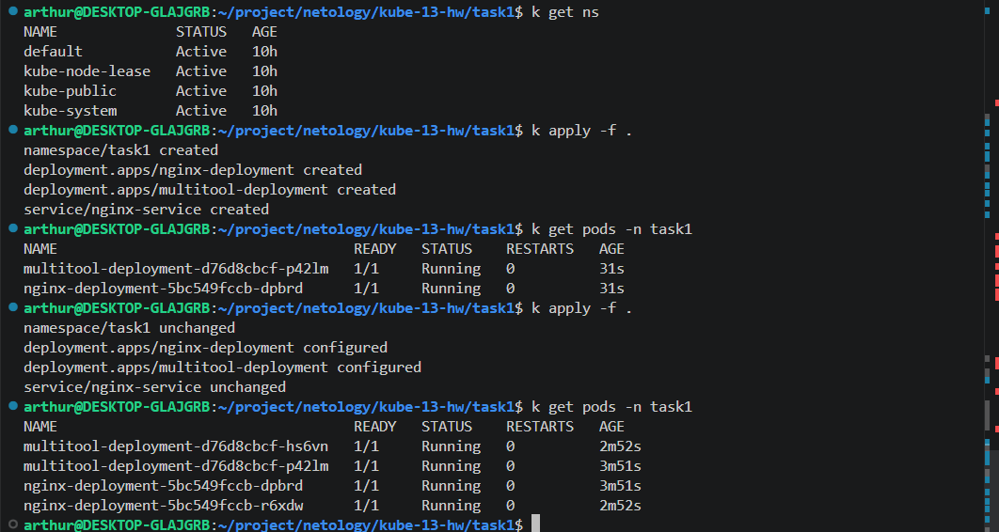
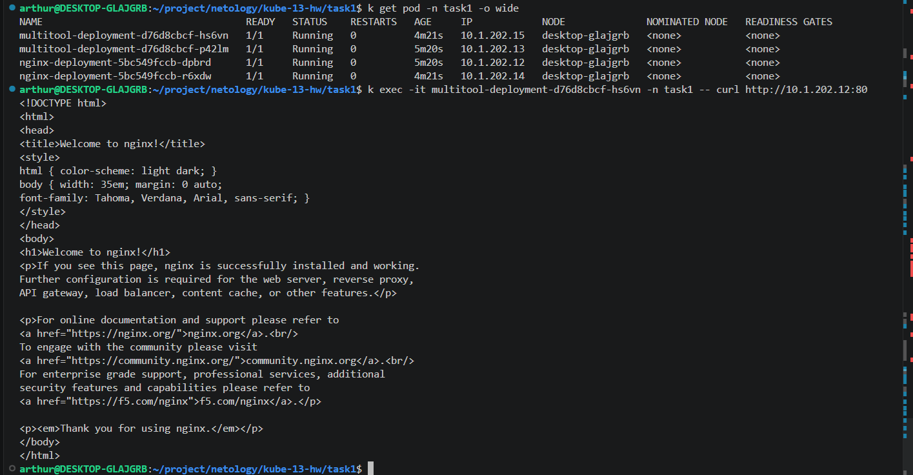
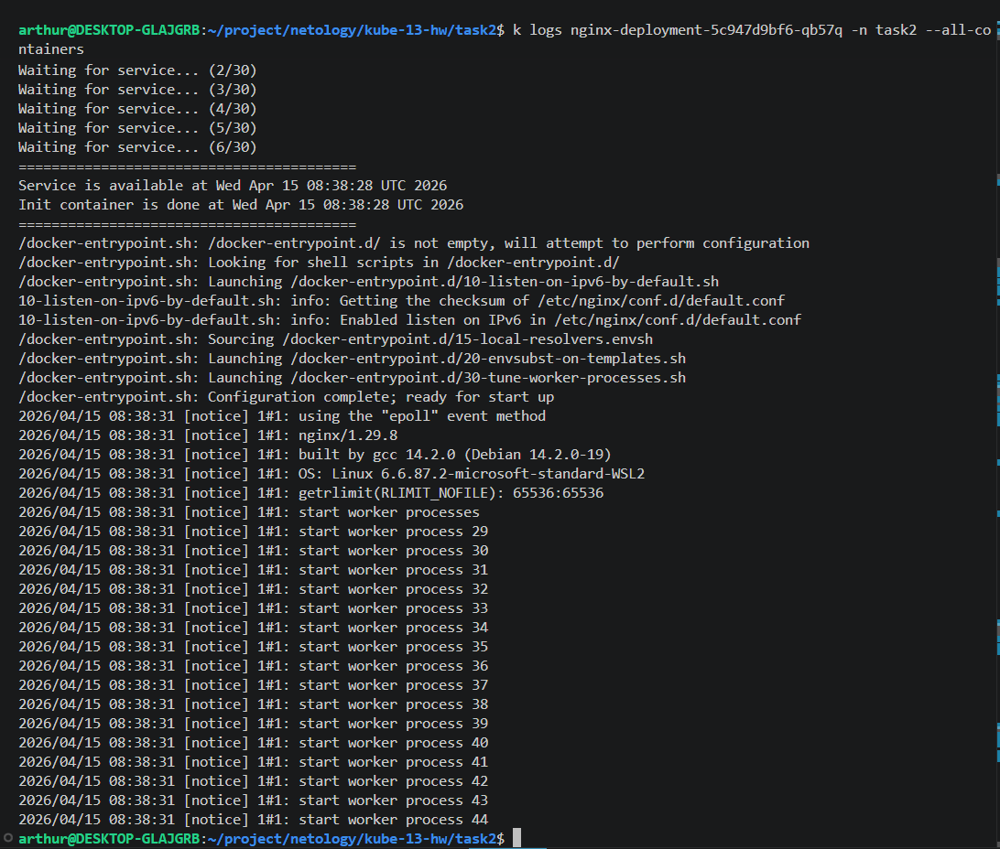

# Домашнее задание к занятию «Запуск приложений в K8S»

### Цель задания

В тестовой среде для работы с Kubernetes, установленной в предыдущем ДЗ, необходимо развернуть Deployment с приложением, состоящим из нескольких контейнеров, и масштабировать его.

------

### Чеклист готовности к домашнему заданию

1. Установленное k8s-решение (например, MicroK8S).
2. Установленный локальный kubectl.
3. Редактор YAML-файлов с подключённым git-репозиторием.

------

### Инструменты и дополнительные материалы, которые пригодятся для выполнения задания

1. [Описание](https://kubernetes.io/docs/concepts/workloads/controllers/deployment/) Deployment и примеры манифестов.
2. [Описание](https://kubernetes.io/docs/concepts/workloads/pods/init-containers/) Init-контейнеров.
3. [Описание](https://github.com/wbitt/Network-MultiTool) Multitool.

------

### Задание 1. Создать Deployment и обеспечить доступ к репликам приложения из другого Pod

1. Создать Deployment приложения, состоящего из двух контейнеров — nginx и multitool. Решить возникшую ошибку.
2. После запуска увеличить количество реплик работающего приложения до 2.
3. Продемонстрировать количество подов до и после масштабирования.
4. Создать Service, который обеспечит доступ до реплик приложений из п.1.
5. Создать отдельный Pod с приложением multitool и убедиться с помощью `curl`, что из пода есть доступ до приложений из п.1.

------

### Задание 2. Создать Deployment и обеспечить старт основного контейнера при выполнении условий

1. Создать Deployment приложения nginx и обеспечить старт контейнера только после того, как будет запущен сервис этого приложения.
2. Убедиться, что nginx не стартует. В качестве Init-контейнера взять busybox.
3. Создать и запустить Service. Убедиться, что Init запустился.
4. Продемонстрировать состояние пода до и после запуска сервиса.

------

### Правила приема работы

1. Домашняя работа оформляется в своем Git-репозитории в файле README.md. Выполненное домашнее задание пришлите ссылкой на .md-файл в вашем репозитории.
2. Файл README.md должен содержать скриншоты вывода необходимых команд `kubectl` и скриншоты результатов.
3. Репозиторий должен содержать файлы манифестов и ссылки на них в файле README.md.

------

# Решение

## Задание 1

Некоторые важны команды

Делаем удобно:
```bash
alias k8s='microk8s'
alias k='k8s kubectl'
```

Чистим всё по namespace:
```bash
k delete namespace task1
```

Получаем ip контейнеров:
```bash
k get pods -n task1 -o wide
```

Или заходим в сам контейнер или если хотим запускаем из него программу:
```bash
k exec -it multitool-deployment-xxx -n task1 -- /bin/sh
k exec -it multitool-deployment-xxx -n task1 -- curl http://xxx:80
```

1. Создаем Deployment приложения, состоящего из двух контейнеров — nginx и multitool.

```bash
k apply -f .
```

2. После запуска увеличить количество реплик работающего приложения до 2. и смотрим количество подов до и после масштабирования.



3. Создать Service, который обеспечит доступ до реплик приложений из п.1. а также создать отдельный Pod с приложением multitool и убедиться с помощью `curl`, что из пода есть доступ до приложений из п.1.



## Задание 2

1. Создать Deployment приложения nginx и обеспечить старт контейнера только после того, как будет запущен сервис

На самом деле Service запускается/настраивается очень быстро, у нас контейнер init не успевает отработать быстрее, поэтому когда мы в нем проверяем nslookup nginx-service.task2.svc.cluster.local то сразу обнаруживаем его и по логам не совсем понятно что init вообще хоть что-то ждал или долден был ждать. Поэтому сделаем задержку в запуске service.

Вот так вначале проверяем, что service отсутствует:
```bash
k get service -n task2
```
После запускаем кластер вот такой командой:
```bash
 k apply -f 00-namespace.yaml -f 01-deployment.yaml && sleep 10 && k apply -f 02-service.yaml
```

Смотрим имя нашего pod-а:
```bash
k get pods -n task2
```

После запуска service мы можем проверить, что init контейнер успешно запустился:
```bash
k logs -n task2 nginx-deployment-xxx -n task2 --all-containers
```

